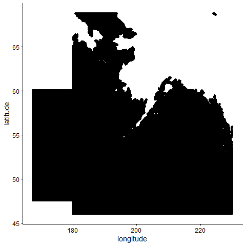
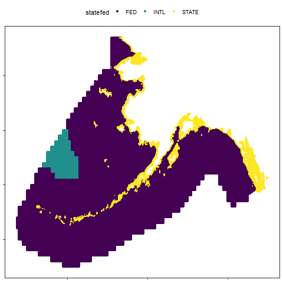
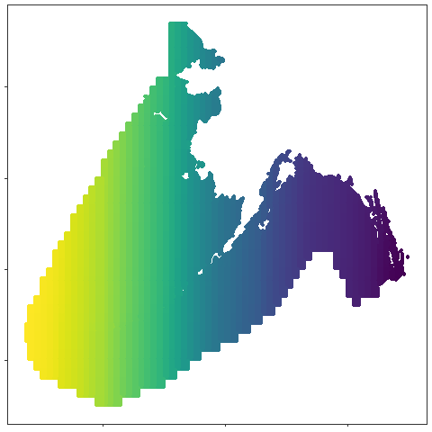
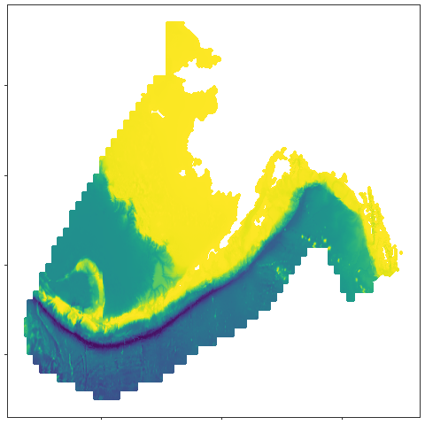
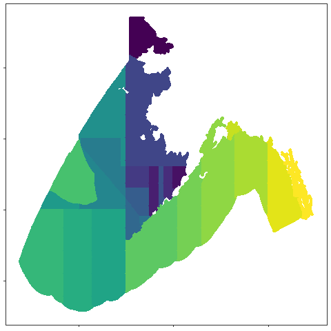
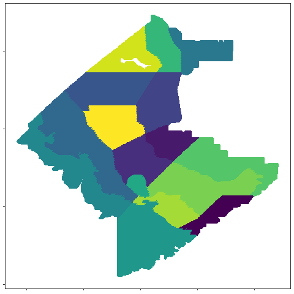
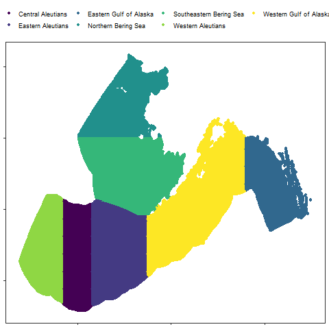

```{r setup, include=FALSE}
knitr::opts_chunk$set(echo = TRUE)
#  Load R libraries
library(tidyverse)
library(ncdf4)
library(raster)
library(RCurl)
library(tidync)
library(lubridate)
library(kableExtra)
library(magrittr)
library(viridis)
```

The full time series dataset for Alaska is quite large but is currently available on request from the author (jordan.watson@noaa.gov). Soon it will also be available via a webAPI for easy download but in the meantime please just contact me. 

The below example will illustrate the process that was undertaken for the full temporal extent of the CRW (Coral Reef Watch) SST dataset. I will illustrate for a single day but will also describe how to extend the process for the full temporal extent. 

The CRW dataset is available through multiple different ERDDAPs (I typically use the Coastwatch West Coast node). The CRW dataset is currently only available (as far as I know) with longitudes -180 to 180 (as opposed to 0 to 360) so we pull the data in two separate chunks, a positive and negative longitude pull. I am only downloading the CRW_SST column but there are other columns that may be of interest to others (e.g., sst anomaly and sea ice). For more information, visit the Coastwatch site (**https://coastwatch.pfeg.noaa.gov/erddap/griddap/NOAA_DHW.html**) or the Coral Reef Watch site (**https://coralreefwatch.noaa.gov/**).

I am working on a combination of a lousy loaner laptop and a virtual machine that has a really small hard drive so I have had to partition these not-all-that-large datasets both temporally and spatially. I download each year into two separate files for both the negative and the positive longitudes, leading to four netCDF files for each year. Because of persistent computer problems, I implement the following code as a loop instead of using an apply or other cleaner coding solution. Thus, when the computer crashes, I at least don't loose my progress to date.    

```{r eval=FALSE}
#  Create a data frame that includes my date strata. Note that for the current year, I won't necessarily know the most recent date for which data are available.
#  openDAP queries allow you to include "last" to pull the most recent date. I ran this code in the second half of 2020, so I knew that the data were available through
#  the end of my first temporal stratum (i.e., end of June). But for the periods of the second half of the year, I included "last" as the end date. 
#  The start and end columns feed the openDAP url while the mylab column populates the destination file name 
datedat <- data.frame(start=c("1985-04-01",paste0(1986:2020,"-01-01"),paste0(1985:2020,"-07-01")),
                      end=c(paste0(1985:2020,"-06-30"),paste0(1985:2019,"-12-31"),"last"),
                      mylab=c(paste0(1985:2020,"_1"),paste0(1985:2020,"_2")))

#  Loop through all of the date ranges and download for the negative longitudes.
#  Each of these files (6 months of data) is several hundred megabytes.
for(i in 1:nrow(datedat)){
  #  Specify the destination file name
  file_name <- paste0("crw_sst_negative_",datedat$mylab[i],".nc")
  
  download.file(url = paste0("https://coastwatch.pfeg.noaa.gov/erddap/griddap/NOAA_DHW.nc?CRW_SST[(",
                             datedat$start[i], # For each loop the start date is here
                             "T12:00:00Z):1:(",
                             datedat$end[i], # For each loop, the end date is here
                             "T12:00:00Z)][(68.75):1:(46.025)][(-179.975):1:(-130)]"),
                method = "libcurl", mode="wb",destfile = file_name)
}

#  Now repeat for the positive longitudes. Each of these files is about 90 megabytes.
for(i in 1:nrow(datedat)){
  file_name <- paste0("crw_sst_positive_",datedat$mylab[i],".nc")
  
  download.file(url = paste0("https://coastwatch.pfeg.noaa.gov/erddap/griddap/NOAA_DHW.nc?CRW_SST[(",
                             datedat$start[i],
                             "T12:00:00Z):1:(",
                             datedat$end[i],
                             "T12:00:00Z)][(60):1:(47.5)][(167.5):1:(179.975)]"),
                method = "libcurl", mode="wb",destfile = file_name)
}
```

Because the above process is laborious and requires several GB of storage, I'll proceed with an example for just a single day's worth of data. I arbitrarily chose 2020-06-01 as a demonstration day.   

```{r eval=FALSE}
#  File for one day should be about 3.5MB
download.file(url = paste0("https://coastwatch.pfeg.noaa.gov/erddap/griddap/NOAA_DHW.nc?CRW_SST[(2020-06-01T12:00:00Z):1:(2020-06-01T12:00:00Z)][(68.75):1:(46.025)][(-179.975):1:(-130)]"),
                method = "libcurl", mode="wb",destfile = "crw_sst_negative_longitudes_06012020.nc")

download.file(url = paste0("https://coastwatch.pfeg.noaa.gov/erddap/griddap/NOAA_DHW.nc?CRW_SST[(2020-06-01T12:00:00Z):1:(2020-06-01T12:00:00Z)][(60):1:(47.5)][(167.5):1:(179.975)]"),
                method = "libcurl", mode="wb",destfile = "crw_sst_positive_longitudes_06012020.nc")
```

The above should have downloaded two different netCDF files. There are multiple ways to access netCDF files in R. The majority are a real pain. The **tidync** package makes it much easier though. In the following steps I will read in the negative and positive longitude files, convert them to tibbles (fancy data frame), convert the date into something more practical. This will give us a gridded dataset with just over 600,000 temperature records per day.    

```{r,eval=FALSE}
data <- tidync("crw_sst_negative_longitudes_06012020.nc") %>% 
  hyper_tibble() %>% 
  bind_rows(tidync("crw_sst_positive_longitudes_06012020.nc") %>% 
  hyper_tibble()) %>% 
  mutate(date=as_datetime(time))
```

There are still way more data here than we need because we downloaded data across rectangular grids.     

```{r, eval=FALSE}
data %>% 
  mutate(longitude=ifelse(longitude<0,longitude+360,longitude)) %>% # for plotting purposes, put longitudes on a continuous scale
  ggplot() + 
  geom_point(aes(longitude,latitude))
```


We need to match these data to each of the different spatial regions of interest (e.g., Ecosystem Status Report, NMFS area, ADFG area, BSIERP area, etc.). I have created a spatial look-up table that matches points from the Coral Reef Watch latitude-longitude grid with each of the different spatial strata. Below we'll do an inner_join to get rid of points that fall outside of our area of interest. In the lookup table, note the **id** column. This is used for storing the spatial information for the full SST time series so that I can subsequently match my full SST dataset with this lookup table without having to store the large latitude and longitude fields. So I will not use it in my example, but it is critical for the operational usage of this dataset.

The spatial strata include:   
**statefed:** Jurisdictional boundaries. Does a point fall in state, federal, or international waters?   
**stat_area:** ADF&G groundfish statistical area (also called stat6 area       https://soa-adfg.opendata.arcgis.com/datasets/commercial-fisheries-groundfish-registration-areas)   
**depth:** Approximate depth at each point as discerned using the marmap R package and the GEBCO bathymetry dataset    
**nmfsarea:** NMFS management area (https://www.fisheries.noaa.gov/webdam/download/89908630)   
**bsierp_name:** Name of each of the 16 bsierp regions (https://access.afsc.noaa.gov/pubs/posters/pdfs/pOrtiz04_marine-regions-bs.pdf)   
**bsierp_id:** The bsierp_name fields can be a tad onerous to type out so this is a numeric id instead   
**Ecosystem:** Three primary regions for Ecosystem Status Reports (Bering Sea, Gulf of Alaska, and Aleutian Islands)    
**Ecosystem_sub:** Subregions within each ESR region (Southeastern and Northern Bering Sea; Eastern, Central, and Western Aleutians; Eastern and Western Gulf of Alaska)     

Many rows may have NA values for some strata (e.g., bsierp_id mostly have NAs because the majority of the rows are not Bering Sea records. Below is an example of several rows where there are no NA values.     

```{r}
lkp <- readRDS("Data/crwsst/crwsst_spatial_lookup_table.RDS")
kable(head(lkp %>% filter(!is.na(bsierp_id)))) 
```


The below code chunk joins the data and look-up tables. Note the use of **%<>%** to reassign data as the joined version of the dataset.     


```{r,message=FALSE}
data %<>% 
  inner_join(lkp)
```


Below will show maps for each of the different spatial strata in the dataset.    

```{r,eval=FALSE}
data %>% 
  mutate(longitude=ifelse(longitude<0,longitude+360,longitude)) %>% 
  filter(!is.na(statefed)) %>% 
  ggplot() + 
  geom_point(aes(longitude,latitude,color=statefed)) + 
  theme_bw() + 
  theme(legend.position = "top",
        axis.text=element_blank(),
        axis.title = element_blank(),
        panel.grid = element_blank()) + 
  scale_colour_viridis(discrete=TRUE)
```


There are too many ADFG stat area to plot each one a different color but for illustration purposes the boundaries are still easy to see in the following map.    

```{r,eval=FALSE}
data %>% 
  mutate(longitude=ifelse(longitude<0,longitude+360,longitude)) %>% 
  filter(!is.na(stat_area)) %>% 
  ggplot() + 
  geom_point(aes(longitude,latitude,color=factor(stat_area))) + 
  theme_bw() + 
  theme(legend.position = "none",
        axis.text=element_blank(),
        axis.title = element_blank(),
        panel.grid = element_blank()) + 
  scale_color_viridis(discrete="TRUE")
```


The next map shows bathymetry using the depths for each point (not really a spatial stratum but useful nonetheless).   

```{r,eval=FALSE}
data %>% 
  mutate(longitude=ifelse(longitude<0,longitude+360,longitude)) %>% 
  filter(!is.na(depth)) %>% 
  ggplot() + 
  geom_point(aes(longitude,latitude,color=depth)) + 
  theme_bw() + 
  theme(legend.position = "none",
        axis.text=element_blank(),
        axis.title = element_blank(),
        panel.grid = element_blank()) + 
  scale_color_viridis()
```


Now for the NMFS areas.    

```{r,eval=FALSE}
data %>% 
  mutate(longitude=ifelse(longitude<0,longitude+360,longitude)) %>% 
  filter(!is.na(nmfsarea)) %>% 
  ggplot() + 
  geom_point(aes(longitude,latitude,color=nmfsarea)) + 
  theme_bw() + 
  theme(legend.position = "none",
        axis.text=element_blank(),
        axis.title = element_blank(),
        panel.grid = element_blank()) + 
  scale_color_viridis(discrete="TRUE")
```


And the BSIERP areas.    

```{r,eval=FALSE}
data %>% 
  mutate(longitude=ifelse(longitude<0,longitude+360,longitude)) %>% 
  filter(!is.na(bsierp_name)) %>% 
  ggplot() + 
  geom_point(aes(longitude,latitude,color=bsierp_name)) + 
  theme_bw() + 
  theme(legend.position = "none",
        axis.text=element_blank(),
        axis.title = element_blank(),
        panel.grid = element_blank()) + 
  scale_color_viridis(discrete=TRUE)
```



And finally, the Ecosystem Status Report areas.     

```{r,eval=FALSE}
data %>% 
  mutate(longitude=ifelse(longitude<0,longitude+360,longitude)) %>% 
  filter(!is.na(Ecosystem_sub)) %>% 
  ggplot() + 
  geom_point(aes(longitude,latitude,color=Ecosystem_sub)) + 
  theme_bw() + 
  theme(legend.position = "top",
        legend.title = element_blank(),
        axis.text=element_blank(),
        axis.title = element_blank(),
        panel.grid = element_blank()) + 
  scale_color_viridis(discrete=TRUE)
```


Finally, returning to the longer time series, within each area, I average temperatures for a particular day and spatial stratum. For the Ecosystem Status Reports, there are 7 spatial strata total, so we would have 7 values per day (one for each area). I demonstrate below for a single date.    

```{r}
data %>% 
  filter(!is.na(Ecosystem_sub)) %>% 
  mutate(date=as_date(date)) %>% 
  group_by(date,Ecosystem_sub) %>% 
  summarise(meansst=round(mean(CRW_SST,na.rm=TRUE),2)) 
```

